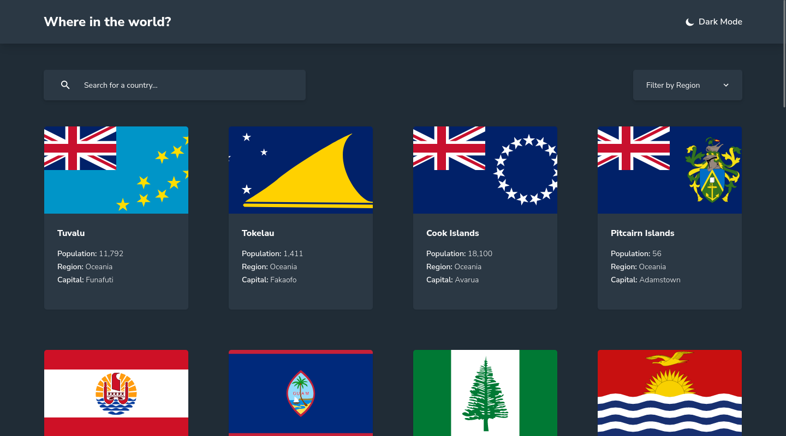

# Frontend Mentor - REST Countries API with color theme switcher solution

This is a solution to the [REST Countries API with color theme switcher challenge on Frontend Mentor](https://www.frontendmentor.io/challenges/rest-countries-api-with-color-theme-switcher-5cacc469fec04111f7b848ca). Frontend Mentor challenges help you improve your coding skills by building realistic projects. 

## Table of contents

- [Overview](#overview)
  - [The challenge](#the-challenge)
  - [Screenshot](#screenshot)
  - [Links](#links)
- [My process](#my-process)
  - [Built with](#built-with)
- [Author](#author)

## Overview

### The challenge

Users should be able to:

- See all countries from the API on the homepage
- Search for a country using an `input` field
- Filter countries by region
- Click on a country to see more detailed information on a separate page
- Click through to the border countries on the detail page
- Toggle the color scheme between light and dark mode *(optional)*

### Screenshot

### Links

- Solution URL: [GitHub](https://github.com/GrzywN/rest-countries-api-with-color-theme-switcher-master)
- Live Site URL: [Netlify](https://dapper-malabi-95e260.netlify.app/)

## My process

### Built with

- Semantic HTML5 markup
- Flexbox / CSS Grid
- Mobile-first workflow

- [React](https://reactjs.org/) - JS library
- [React Router v6](https://reactrouter.com/en/main) - React routing
- [TypeScript](https://www.typescriptlang.org/) - JavaScript with syntax for types.
- [Tailwind CSS](https://tailwindcss.com/) - CSS framework
- [Vite](https://vitejs.dev/) - Bundler / Runtime
- [ESLint](https://eslint.org/) - Linter
- [Prettier](https://prettier.io/) - Code formatter

## Author

- Website - [karolbinkowski.me](https://karolbinkowski.me)
- Frontend Mentor - [@GrzywN](https://www.frontendmentor.io/profile/GrzywN)
- Twitter - [@GrzywN](https://www.twitter.com/GrzywN)
